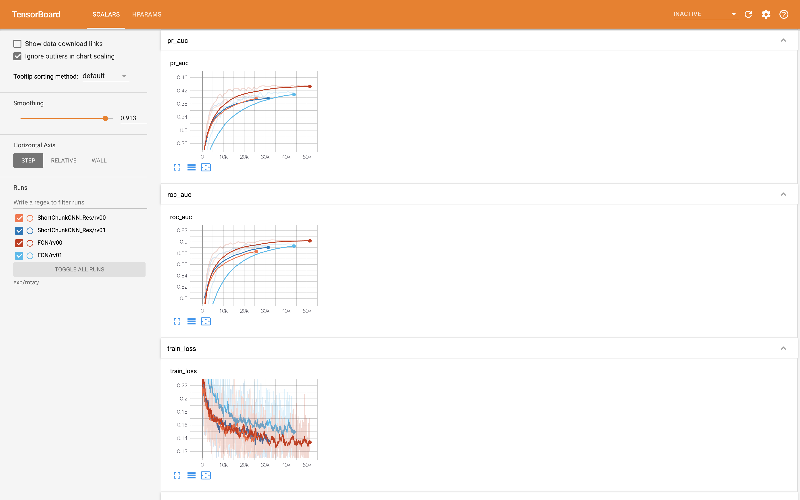

# Automatic tagging using deep convolutional neural networks

[](https://codecov.io/gh/HephaestusProject/template)
[](https://github.com/psf/black)

## Abstract

* Pytorchlightning Implementation of Automatic tagging using deep convolutional neural networks

Musical tags are used to describe music such as genre or instrument of specific music, emotion, era or theme. It is similar with image class label (Dog, Cat, Human) or image attribute (Color, Shape, Form). In this project, the Multi-Label Classification Task for a given music is solved using Magnatune data with 50 tags.

**TL;DR**
- Implement experiment management and data analysis using `pytorchlightning`.
- Two models are implemented for short audio (3.7 seconds) and long audio (29 seconds) inference. `FCN: long audio, ShortChunkCNN_Res: short audio`
- Every Load to STFT will be done on-the-fly `you do not need .npy files`.


* Use Tags & Split dataset
- Referecne: https://github.com/minzwon/sota-music-tagging-models/tree/master/split/mtat
```
['guitar', 'classical', 'slow', 'techno', 'strings', 'drums',
'electronic', 'rock', 'fast', 'piano', 'ambient', 'beat', 'violin',
'vocal', 'synth', 'female', 'indian', 'opera', 'male', 'singing',
'vocals', 'no vocals', 'harpsichord', 'loud', 'quiet', 'flute',
'woman', 'male vocal', 'no vocal', 'pop', 'soft', 'sitar', 'solo',
'man', 'classic', 'choir', 'voice', 'new age', 'dance',
'male voice', 'female vocal', 'beats', 'harp', 'cello', 'no voice',
'weird', 'country', 'metal', 'female voice', 'choral']
```

## Available Models

- **FCN** : Automatic Tagging using Deep Convolutional Neural Networks, Choi et al., 2016 [[arxiv](https://arxiv.org/abs/1606.00298)]
- **Short-chunk CNN + Residual** : Short-chunk CNN with residual connections.[[arxiv](https://arxiv.org/abs/2006.00751)]

## Requirements

```
conda create -n YOUR_ENV_NAME python=3.7
conda activate YOUR_ENV_NAME
pip install -r requirements.txt
```

## Training history


```
tensorboard --logdir exp/mtat/ 
```


### Training & Evaluate
```
python train.py --model FCN
```
Options
```
"--model", default="ShortChunkCNN_Res", type=str, choices=["FCN","ShortChunkCNN_Res"]
"--dataset", default="mtat", type=str, choices=["mtat"]
"--pipeline", default="pv00", type=str, choices=["pv00", "pv01"]
"--runner", default="rv00", type=str, choices=["rv00", "rv01"]
"--reproduce", default=False, action="store_true"
```

```
python evaluate.py --model FCN --checkpoint epoch=40-roc_auc=0.8961-pr_auc=0.4152
```
Options
```
"--model", default="ShortChunkCNN_Res", type=str, choices=["FCN","ShortChunkCNN_Res"]
"--dataset", default="mtat", type=str, choices=["mtat"]
"--pipeline", default="pv00", type=str, choices=["pv00", "pv01"]
"--runner", default="rv00", type=str, choices=["rv00", "rv01"]
"--reproduce", default=False, action="store_true"
"--checkpoint", default="epoch=40-roc_auc=0.8961-pr_auc=0.4152", type=str
```
### Inference
The model output comes out as a continuous value for each tag. Therefore, we can receive the tag according to a reliable threshold. (This can be replaced by argmax)
```
python infer.py --threshold 0.4
```
Options
```
"--model", default="FCN", type=str, choices=["ShortChunkCNN_Res","FCN"]
"--dataset", default="mtat", type=str
"--runner", default="rv00", type=str
"--threshold", default=0.4, type=float
"--pipeline", default="pv00", type=str
"--audio_path", default="dataset/mtat/test_mp3/sample1.mp3", type=str, choices=["dataset/test_mp3/sample1.mp3", "dataset/test_mp3/sample2.mp3"]
```

## Inference by OpenAPI

## Usage

### Environment

### Project structure

### License
* Licensed under an MIT license.

